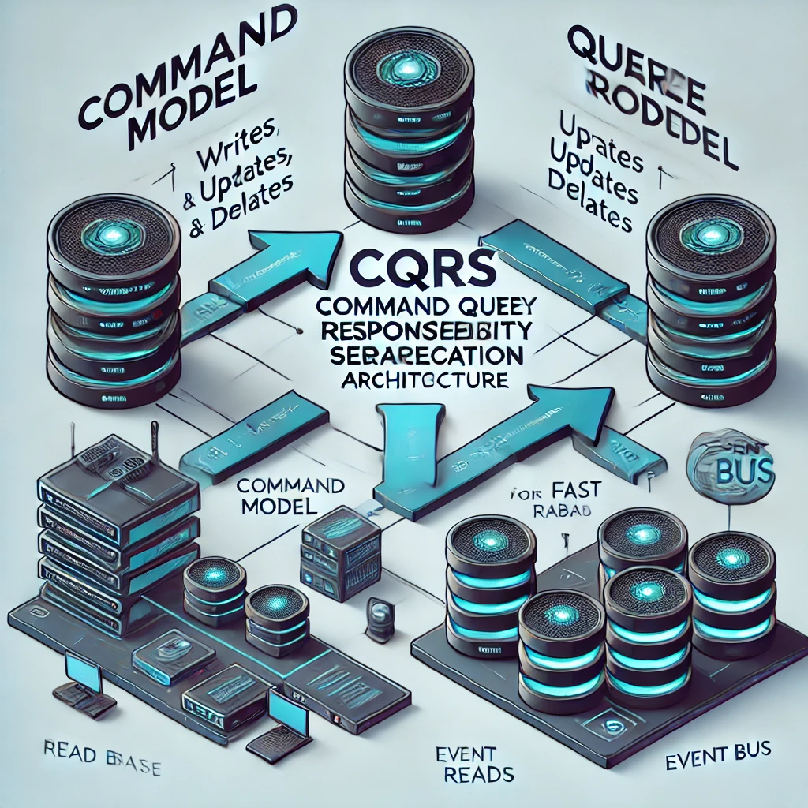

# CQRS (Command Query Responsibility Segregation) Architecture

## 📌 Introduction
**CQRS (Command Query Responsibility Segregation)** is a software architectural pattern that separates read and write operations to optimize performance, scalability, and maintainability.

## 🏗️ Key Concepts
1. **Command Side (Write Model) ✍️**
   - Handles state-changing operations (Create, Update, Delete).
   - Ensures strong consistency and business rule enforcement.
   - Example: Processing an order in an e-commerce system.

2. **Query Side (Read Model) 🔍**
   - Handles read operations efficiently.
   - Can be optimized with denormalized data stores for fast retrieval.
   - Example: Displaying order details to a user.

3. **Event Sourcing (Optional) 📜**
   - Instead of storing the current state, the system records a sequence of events.
   - Enables audit logging and replaying events for debugging or recovery.

## ⚖️ Traditional CRUD vs CQRS
| Feature         | Traditional CRUD | CQRS |
|---------------|----------------|------|
| Data Model    | Single model for read & write | Separate models for read & write |
| Performance   | Can suffer due to inefficient queries | Optimized for both reads and writes |
| Scalability   | Limited by a single database | Highly scalable with independent read & write models |
| Complexity    | Simple but can become unoptimized | More complex but better performance |
| Consistency   | Strong consistency | Can use eventual consistency for reads |

## 🎯 Benefits of CQRS
✅ **Scalability** – Independent scaling of read and write workloads.  
✅ **Performance Optimization** – Separate databases for read-heavy and write-heavy operations.  
✅ **Flexibility** – Use different data stores for querying (SQL, NoSQL, GraphDB).  
✅ **Security & Access Control** – Different authorization rules for reads and writes.  
✅ **Improved Maintainability** – Clear separation of concerns makes code easier to manage.

## ⚠️ Challenges of CQRS
❌ **Increased Complexity** – More components and services to manage.  
❌ **Eventual Consistency** – Read models may not reflect changes immediately.  
❌ **Data Synchronization** – Keeping read and write models in sync requires event handling.  
❌ **Infrastructure Overhead** – Requires additional storage and messaging systems.

## 🚀 Best Practices
- **Use CQRS Where Needed** – Avoid over-engineering simple applications.
- **Leverage Event Sourcing** – If audit logging or data recovery is required.
- **Implement Asynchronous Messaging** – Use event-driven patterns for syncing models.
- **Optimize Read Models** – Use caching or NoSQL for fast lookups.
- **Secure Commands & Queries Separately** – Different authentication and authorization strategies.

## 🛠️ Tools & Technologies
- **Command Handling**: MediatR (C#), Axon Framework (Java), Redux (JS)
- **Messaging & Event Sourcing**: Kafka, RabbitMQ, AWS EventBridge
- **Databases**: PostgreSQL (Write), Elasticsearch/MongoDB (Read)
- **Caching**: Redis, Memcached
- **Microservices & API Management**: GraphQL, gRPC, REST APIs

## 🌍 Real-World Use Cases
- **E-Commerce Systems** 🛒
  - Separate read and write models for handling orders and inventory.
- **Financial Transactions** 💰
  - Secure write operations while providing fast read queries for reporting.
- **Healthcare Systems** 🏥
  - Maintain patient records while providing fast search and retrieval.
- **Logistics & Supply Chain** 🚛
  - Real-time updates for warehouse and delivery tracking.

## 🎬 Case Study: Uber
Uber uses **CQRS and Event Sourcing** for:
- **Ride Booking & Payments**: Handling separate read and write operations.
- **Real-time Driver Location Updates**: Using event-driven architecture.
- **Optimized Data Access**: Faster querying for available rides and pricing.

## 🏁 Conclusion
CQRS is a **powerful architectural pattern** that improves scalability, performance, and maintainability. While it introduces complexity, its advantages make it an excellent choice for applications requiring high read/write separation and event-driven processing.

## 📚 References
- "CQRS Journey" by Microsoft Patterns & Practices
- Martin Fowler’s CQRS and Event Sourcing articles
- Domain-Driven Design by Eric Evans

