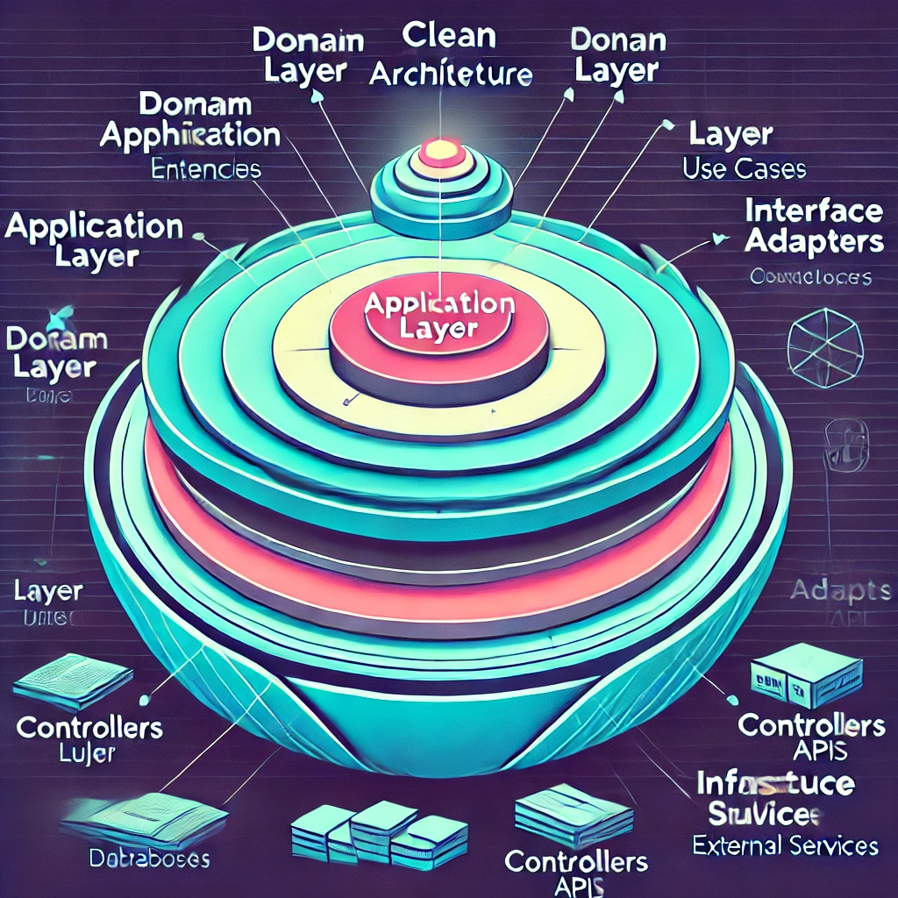

# Clean (Onion) Architecture

## 📌 Introduction
**Clean Architecture**, also known as **Onion Architecture**, is a software design pattern that emphasizes maintainability, testability, and separation of concerns. It was popularized by Robert C. Martin (Uncle Bob) and follows a layered approach to structuring applications.

## 🏗️ Key Principles
1. **Separation of Concerns** – Each layer has a distinct responsibility.
2. **Dependency Rule** – Inner layers should not depend on outer layers.
3. **Testability** – Business logic remains independent of external dependencies.
4. **Flexibility & Maintainability** – Changes in external frameworks do not affect core logic.

## 🏛️ Layers of Clean (Onion) Architecture
1. **Entities (Domain Layer) 🏗️**
   - Core business logic and rules.
   - Independent of any frameworks or libraries.
   - Example: `Order`, `User`, `Product` models with domain rules.

2. **Use Cases (Application Layer) ⚙️**
   - Contains business rules and workflows.
   - Coordinates communication between domain entities and outer layers.
   - Example: `ProcessOrder`, `CalculateDiscount` services.

3. **Interface Adapters (Presentation Layer) 🎭**
   - Bridges business logic and external systems.
   - Includes controllers, APIs, UI components.
   - Example: REST API controllers, GraphQL resolvers.

4. **Infrastructure (External Layer) ☁️**
   - Handles databases, messaging systems, and frameworks.
   - Example: `PostgreSQL`, `Redis`, `Kafka` integrations.

## ⚖️ Clean Architecture vs Traditional Architecture
| Feature          | Clean Architecture | Traditional Architecture |
|-----------------|------------------|-------------------|
| Maintainability | High              | Low               |
| Testability     | High              | Hard to isolate logic |
| Scalability     | High              | Difficult         |
| Coupling        | Loose             | Tight            |
| Dependency Flow | Inward            | Outward          |

## 🎯 Benefits of Clean Architecture
✅ **Independent of UI & Database** – Business logic is isolated from frameworks.  
✅ **Easier to Test** – Each layer can be tested independently.  
✅ **Improved Maintainability** – Changes in UI or database do not affect core logic.  
✅ **Flexible & Scalable** – Supports microservices, monoliths, and hybrid models.  
✅ **Separation of Concerns** – Enhances code organization and readability.

## ⚠️ Challenges of Clean Architecture
❌ **More Boilerplate Code** – Requires additional setup for layers.  
❌ **Higher Learning Curve** – Developers need to understand layered dependencies.  
❌ **Potential Overhead** – Not always necessary for small applications.

## 🚀 Best Practices
- **Follow Dependency Inversion Principle (DIP)** – Keep high-level modules independent of low-level details.
- **Use Interfaces & Dependency Injection** – Ensure flexibility and testability.
- **Keep Business Logic Pure** – Avoid framework-specific dependencies.
- **Modularize Use Cases** – Keep workflows isolated for better reusability.
- **Adopt SOLID Principles** – Improves maintainability and scalability.

## 🛠️ Tools & Technologies
- **Backend Frameworks**: .NET Core, Spring Boot, NestJS
- **Databases**: PostgreSQL, MongoDB, MySQL
- **Dependency Injection**: Autofac, Dagger, Spring DI
- **Testing**: Jest, NUnit, JUnit, PyTest
- **Messaging & Event Handling**: RabbitMQ, Kafka

## 🌍 Real-World Use Cases
- **Enterprise Applications** 🏢
  - Modular and scalable architectures for large-scale businesses.
- **E-Commerce Platforms** 🛒
  - Enables flexibility in payment, inventory, and order management.
- **FinTech & Banking** 💰
  - Secure, modularized, and easily testable core logic.
- **Healthcare Systems** 🏥
  - Ensures compliance and maintainability with strict regulations.

## 🎬 Case Study: Microsoft & .NET Core
Microsoft promotes **Clean Architecture** in .NET Core applications, using:
- **Domain-Driven Design (DDD)** for modular structure.
- **Dependency Injection (DI)** to maintain clean dependencies.
- **Test-Driven Development (TDD)** to ensure software quality.

## 🏁 Conclusion
Clean Architecture provides **scalability, testability, and maintainability** for modern applications. While it has an initial complexity, the long-term benefits in code quality and flexibility make it a powerful design choice.

## 📚 References
- "Clean Architecture" by Robert C. Martin
- "The Onion Architecture" by Jeffrey Palermo
- Microsoft .NET Clean Architecture Guidelines

