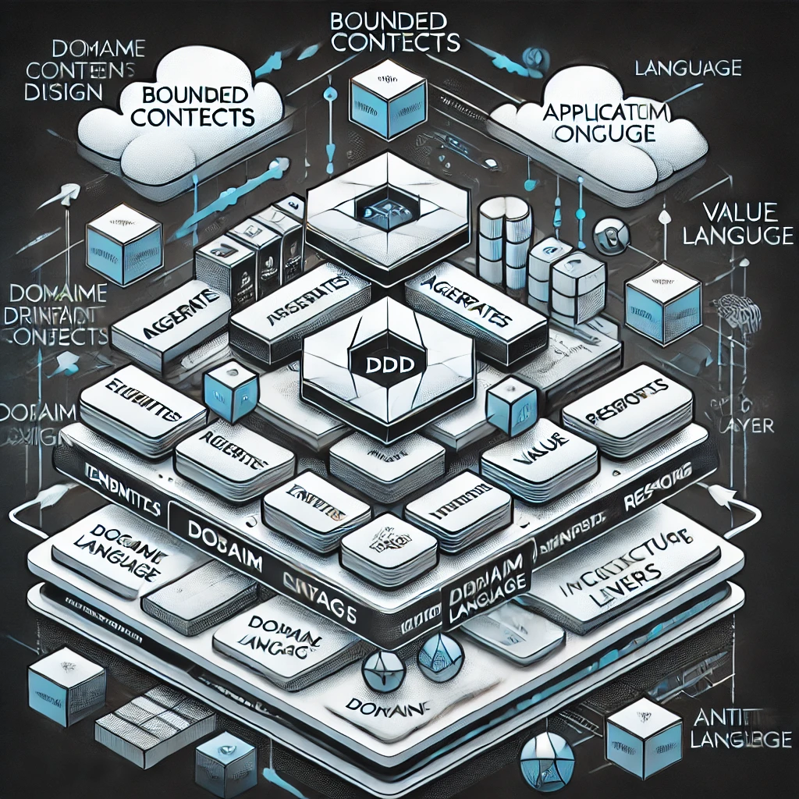

# Domain-Driven Design (DDD) Architecture

## 📌 Introduction
**Domain-Driven Design (DDD)** is a software development approach that focuses on aligning the software model closely with business logic and domain expertise. It helps build maintainable, scalable, and domain-focused applications.

## 🏗️ Key Concepts
1. **Domain** 🏛️
   - The problem space that the software is intended to address.
   - Example: E-commerce, banking, healthcare.

2. **Entities** 🆔
   - Objects with a unique identity that persists over time.
   - Example: `Order`, `Customer`, `Product`.

3. **Value Objects** 📦
   - Immutable objects that do not have an identity.
   - Example: `Address`, `Money`, `Coordinates`.

4. **Aggregates** 🔗
   - A cluster of domain objects treated as a single unit.
   - Example: An `Order` aggregate that includes `OrderItems` and `ShippingDetails`.

5. **Repositories** 🗄️
   - Abstraction for data access, allowing persistence without exposing database logic.
   - Example: `OrderRepository`, `CustomerRepository`.

6. **Domain Events** 📢
   - Messages that indicate something important happened in the domain.
   - Example: `OrderPlaced`, `PaymentProcessed`.

7. **Bounded Contexts** 🎯
   - A logical boundary within the domain that encapsulates a subdomain.
   - Example: `Billing Context`, `Inventory Context`, `Shipping Context`.

8. **Anti-Corruption Layer** 🛡️
   - A layer that translates between different models to prevent dependency issues.

## ⚖️ DDD vs Traditional Development
| Feature        | DDD Architecture | Traditional Development |
|--------------|----------------|-------------------|
| Business Alignment | High | Often neglected |
| Code Maintainability | High | Can become complex |
| Separation of Concerns | Strong | Weaker separation |
| Scalability | High | Limited |
| Complexity | Higher initially | Lower but grows over time |

## 🎯 Benefits of DDD
✅ **Closer Business Alignment** – Software reflects real business models.  
✅ **Improved Maintainability** – Well-structured domains make future changes easier.  
✅ **Better Collaboration** – Encourages communication between developers and domain experts.  
✅ **Scalability** – Clear boundaries help scale different parts independently.  
✅ **Flexibility** – Adapts well to microservices and event-driven architectures.  

## ⚠️ Challenges of DDD
❌ **Steep Learning Curve** – Requires understanding of domain modeling concepts.  
❌ **Higher Initial Effort** – More upfront design and collaboration with domain experts.  
❌ **Complexity in Large Systems** – Requires careful design to prevent overly complex models.  
❌ **Requires Domain Knowledge** – Developers need a deep understanding of the business.  

## 🚀 Best Practices
- **Define Clear Bounded Contexts** – Avoid overlapping responsibilities.
- **Use Ubiquitous Language** – Maintain consistent terminology between developers and business experts.
- **Leverage Aggregates Wisely** – Keep aggregates small to avoid transactional bottlenecks.
- **Implement Domain Events** – Ensure proper communication between contexts.
- **Adopt CQRS with DDD** – Separate read and write concerns where necessary.

## 🛠️ Tools & Technologies
- **Frameworks**: Spring Boot (Java), NestJS (Node.js), ASP.NET Core (C#)
- **Database Solutions**: PostgreSQL, MongoDB, Event Store
- **Event Handling**: Kafka, RabbitMQ, AWS EventBridge
- **Dependency Injection**: Spring DI, Autofac, Dagger
- **Testing**: Xunit, Jest, JUnit

## 🌍 Real-World Use Cases
- **E-Commerce Platforms** 🛒
  - Separates cart, payments, and inventory into bounded contexts.
- **Banking & FinTech** 💰
  - Implements strong domain models for transactions and compliance.
- **Healthcare Systems** 🏥
  - Organizes patient records, billing, and scheduling into distinct domains.
- **Supply Chain Management** 🚛
  - Segments logistics, warehousing, and order processing.

## 🎬 Case Study: Netflix
Netflix uses **DDD principles** for:
- **Microservices Design** – Bounded contexts for streaming, recommendations, and user profiles.
- **Scalability** – Independent services that can scale based on domain needs.
- **Event-Driven Systems** – Using domain events for real-time updates and interactions.

## 🏁 Conclusion
DDD is a **powerful architectural pattern** that improves software alignment with business needs. While it requires initial investment and domain knowledge, its benefits in **scalability, maintainability, and flexibility** make it a great choice for complex applications.

## 📚 References
- "Domain-Driven Design" by Eric Evans
- "Implementing Domain-Driven Design" by Vaughn Vernon
- Microservices and DDD articles from Martin Fowler

