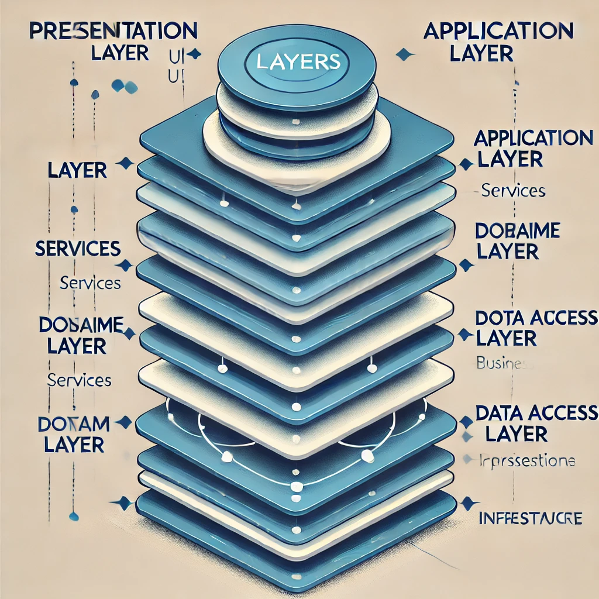

# Layered (N-Tier) Architecture

## 📌 Introduction
**Layered Architecture (N-Tier Architecture)** is a software design pattern that organizes an application into multiple layers, each responsible for a specific aspect of functionality. This approach improves maintainability, scalability, and separation of concerns.

## 🏗️ Key Layers
1. **Presentation Layer (UI) 🎭**
   - Handles user interactions.
   - Example: Web pages, mobile apps, REST API controllers.

2. **Application Layer (Service Layer) ⚙️**
   - Contains business logic and application rules.
   - Example: Order processing, authentication handling.

3. **Domain Layer (Business Logic) 🏛️**
   - Core business rules and domain models.
   - Example: `Order`, `Customer`, `Invoice` classes.

4. **Data Access Layer (Persistence) 🗄️**
   - Manages database interactions.
   - Example: `Repository` classes, ORM (Entity Framework, Hibernate).

5. **Infrastructure Layer ☁️**
   - Handles external dependencies like messaging, file storage, APIs.
   - Example: Message queues, external APIs, caching.

## ⚖️ Layered vs Other Architectures
| Feature        | Layered Architecture | Microservices | Clean Architecture |
|--------------|-------------------|--------------|----------------|
| Complexity   | Moderate         | High         | High           |
| Maintainability | High           | Moderate     | High           |
| Scalability  | Limited          | High         | Moderate       |
| Separation of Concerns | Strong  | Strong       | Very Strong    |
| Coupling     | Tight (but modular) | Loose     | Loose          |

## 🎯 Benefits of Layered Architecture
✅ **Separation of Concerns** – Each layer has a clear responsibility.  
✅ **Easier Maintenance** – Changes in one layer do not affect others.  
✅ **Reusability** – Components can be reused across different parts of the system.  
✅ **Scalability** – Can scale horizontally by adding more instances of layers.  
✅ **Security** – Business logic is protected from direct client access.  

## ⚠️ Challenges of Layered Architecture
❌ **Performance Overhead** – Multiple layers can add latency.  
❌ **Tight Coupling Between Layers** – Changes in one layer may impact others.  
❌ **Limited Scalability** – Not as scalable as microservices.  
❌ **Redundant Code** – May require repetitive code in different layers.  

## 🚀 Best Practices
- **Keep Layers Independent** – Avoid direct dependencies between layers.
- **Use Dependency Injection** – Reduce coupling and improve flexibility.
- **Optimize Performance** – Use caching and reduce unnecessary data fetching.
- **Follow SOLID Principles** – Ensure maintainable and extensible code.
- **Encapsulate Business Logic** – Keep domain logic isolated from other concerns.

## 🛠️ Tools & Technologies
- **Frontend (Presentation Layer)**: React, Angular, Vue.js
- **Backend (Application Layer)**: Spring Boot, .NET Core, Node.js
- **Database (Persistence Layer)**: PostgreSQL, MongoDB, MySQL
- **ORM & Data Access**: Hibernate, Entity Framework, Prisma
- **Infrastructure**: Redis (caching), Kafka (messaging), AWS S3 (storage)

## 🌍 Real-World Use Cases
- **Enterprise Applications** 🏢
  - Large-scale business applications with structured modular design.
- **E-Commerce Platforms** 🛒
  - Separates UI, business logic, and database interactions.
- **Banking & Financial Systems** 💰
  - Ensures secure handling of transactions and data integrity.
- **Healthcare Systems** 🏥
  - Manages patient records, billing, and reporting in separate layers.

## 🎬 Case Study: Netflix
Netflix initially used a **layered monolithic architecture** but later evolved to **microservices** to improve scalability. However, they still maintain **layered design principles** within each microservice for better maintainability.

## 🏁 Conclusion
Layered Architecture is a **well-structured, maintainable, and modular** approach suitable for many enterprise applications. While it introduces some performance overhead and coupling, following best practices ensures scalability and flexibility.

## 📚 References
- "Patterns of Enterprise Application Architecture" by Martin Fowler
- Microsoft N-Tier Architecture Guidelines
- Layered Design in Spring Boot and .NET Core