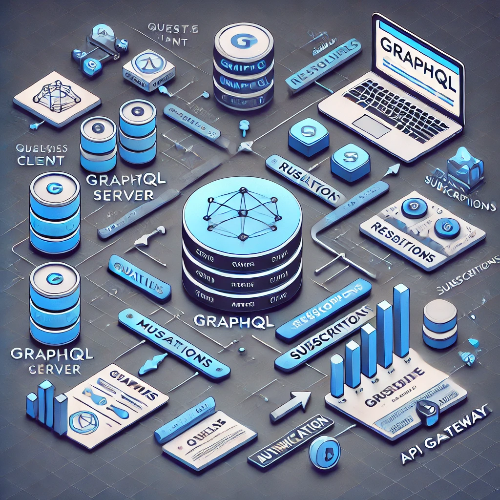

# 📂 Software Architecture Patterns
🚀 A collection of 10+ software architecture patterns commonly used in modern applications. Each directory contains:
- 📜 **A detailed Markdown file** explaining the architecture.
- 🖼️ **A visual representation** of the architecture.

## 📌 Architectures Included
### 1️⃣ Microservices 🏗️
- **File:** [`microservice.md`](./_Microservice/microservice.md)
- **Diagram:** 

### 2️⃣ Event-Driven ⚡
- **File:** [`event-driven.md`](./_Event-Driven/event-driven.md)
- **Diagram:** 

### 3️⃣ Serverless ☁️
- **File:** [`serverless.md`](./_Serverless/serverless.md)
- **Diagram:** 

### 4️⃣ Clean (Onion) 🏛️
- **File:** [`clean.md`](./Clean(Onion)/clean.md)
- **Diagram:** /clean.webp)

### 5️⃣ CQRS (Command-Query-Responsibility Segregation) ⚙️
- **File:** [`cqrs.md`](./CQRS(Command-Query-Responsibility-Segregation)/cqrs.md)
- **Diagram:** /cqrs.webp)

### 6️⃣ Domain-Driven Design (DDD) 📌
- **File:** [`ddd.md`](./Domain-Driven-Design(DDD)/ddd.md)
- **Diagram:** /ddd.webp)

### 7️⃣ GraphQL API 🔗
- **File:** [`graphql-api.md`](./GraphQL-API/graphql-api.md)
- **Diagram:** 

### 8️⃣ Layered (N-Tier) 🏢
- **File:** [`layered.md`](./Layered(N-Tier)/layered.md)
- **Diagram:** /layered.webp)

### 9️⃣ Repository Pattern 📚
- **File:** [`repository-pattern.md`](./Repository-Pattern/repository-pattern.md)
- **Diagram:** 

### 🔟 RESTful API 🌍
- **File:** [`restful-api.md`](./RESTful-API/restful-api.md)
- **Diagram:** 

---
## 💡 How to Use
1. Clone the repository:
   ```bash
   git clone https://github.com/your-repo/software-architecture-patterns.git
   ```
2. Browse the directories and read the corresponding `.md` files for in-depth explanations.
3. View the architecture diagrams for a visual understanding.

## 🎯 Contribution
🚀 Contributions are welcome! Feel free to submit PRs to add more architecture patterns or improve existing ones.

## 🏆 Credits
Curated by **[Ryan Heida]** 🎉

---
📌 **Stay tuned for more updates!** ✨

