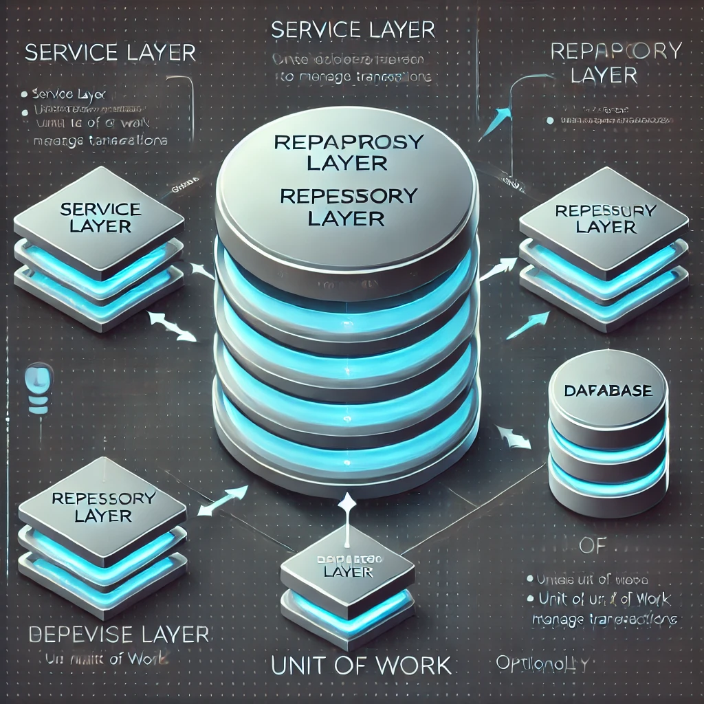

# Repository Pattern Architecture



## 📌 Introduction
The **Repository Pattern** is a design pattern that abstracts data access logic, providing a centralized interface for managing persistence operations. It enhances maintainability, testability, and flexibility by decoupling business logic from data access layers.

## 🏗️ Key Concepts
1. **Repository Interface 🗄️**
   - Defines the standard data operations (CRUD) without implementation details.
   - Example:
     ```csharp
     public interface IUserRepository {
         User GetById(int id);
         void Add(User user);
         void Update(User user);
         void Delete(int id);
     }
     ```

2. **Concrete Repository Implementation ⚙️**
   - Implements data access logic using a database or API.
   - Example:
     ```csharp
     public class UserRepository : IUserRepository {
         private readonly DbContext _context;
         public UserRepository(DbContext context) {
             _context = context;
         }
         public User GetById(int id) => _context.Users.Find(id);
         public void Add(User user) => _context.Users.Add(user);
         public void Update(User user) => _context.Users.Update(user);
         public void Delete(int id) => _context.Users.Remove(GetById(id));
     }
     ```

3. **Service Layer (Business Logic) 🏛️**
   - Uses the repository to execute domain operations.
   - Example:
     ```csharp
     public class UserService {
         private readonly IUserRepository _userRepository;
         public UserService(IUserRepository userRepository) {
             _userRepository = userRepository;
         }
         public User GetUser(int id) => _userRepository.GetById(id);
     }
     ```

4. **Unit of Work (Optional) 🔄**
   - Manages transactions and ensures consistency across repositories.
   - Example:
     ```csharp
     public interface IUnitOfWork {
         IUserRepository Users { get; }
         void SaveChanges();
     }
     ```

## ⚖️ Repository Pattern vs Direct Data Access
| Feature       | Repository Pattern | Direct Data Access |
|--------------|-------------------|------------------|
| Abstraction  | High              | Low              |
| Testability  | High (mockable)   | Low (tightly coupled) |
| Maintainability | High           | Difficult        |
| Code Reusability | High          | Low              |
| Dependency   | Loose             | Tight            |

## 🎯 Benefits of Repository Pattern
✅ **Separation of Concerns** – Decouples business logic from persistence.  
✅ **Improved Testability** – Can mock repositories for unit tests.  
✅ **Maintainability** – Centralizes data access logic for easier modifications.  
✅ **Flexibility** – Supports multiple data sources (SQL, NoSQL, APIs).  
✅ **Encapsulation** – Shields domain logic from database complexities.  

## ⚠️ Challenges of Repository Pattern
❌ **Overhead** – Adds extra layers of abstraction.  
❌ **Complexity** – Requires additional setup for repositories and dependency injection.  
❌ **Potential Duplication** – May lead to redundant repository methods.  

## 🚀 Best Practices
- **Use Dependency Injection** – Inject repositories into services.
- **Avoid Fat Repositories** – Keep repository logic focused on data access.
- **Implement Generic Repositories** – Use a base repository to reduce redundancy.
- **Combine with Unit of Work** – Manage multiple repositories within a single transaction.
- **Optimize Queries** – Use caching and efficient query mechanisms.

## 🛠️ Tools & Technologies
- **ORMs & Database Access**: Entity Framework, Hibernate, Dapper
- **Dependency Injection**: Spring DI, Autofac, .NET Core DI
- **Unit Testing**: NUnit, xUnit, Moq
- **NoSQL Support**: MongoDB, Firebase, CosmosDB
- **Microservices Integration**: REST, GraphQL, gRPC

## 🌍 Real-World Use Cases
- **Enterprise Applications** 🏢
  - Centralized data access for large-scale business systems.
- **E-Commerce Platforms** 🛒
  - Managing products, orders, and customer information efficiently.
- **Financial Systems** 💰
  - Ensuring transactional integrity and maintainability in banking applications.
- **Healthcare Systems** 🏥
  - Handling patient records and appointments securely.

## 🎬 Case Study: Microsoft .NET Architecture
Microsoft promotes the **Repository Pattern** in its **Clean Architecture**, using:
- **Dependency Injection** for flexible repository management.
- **Unit of Work** to ensure database consistency.
- **Generic Repositories** for reusability across different entities.

## 🏁 Conclusion
The Repository Pattern enhances **maintainability, testability, and separation of concerns** in software architecture. While it introduces some complexity, its advantages in **flexibility and abstraction** make it an excellent choice for managing data access in large applications.

## 📚 References
- "Patterns of Enterprise Application Architecture" by Martin Fowler
- Microsoft Repository Pattern Guidelines
- Best Practices in Entity Framework and Hibernate

