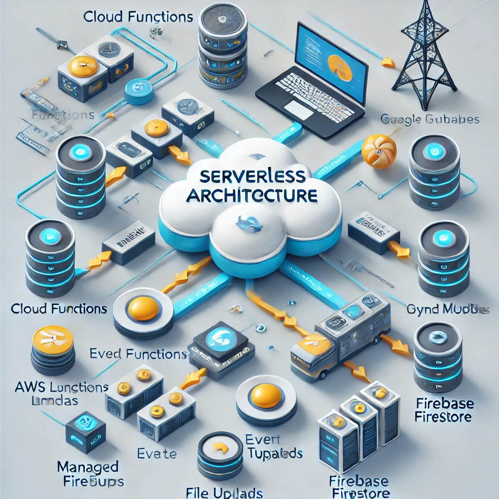

# Serverless Architecture

## 📌 Introduction
**Serverless Architecture** is a cloud computing execution model where cloud providers automatically manage the infrastructure, scaling, and execution of applications. Developers focus on writing code without worrying about provisioning or maintaining servers.

## 🏗️ Key Components
1. **Function-as-a-Service (FaaS) ⚙️**
   - Event-driven, stateless functions executed in response to triggers.
   - Examples: AWS Lambda, Google Cloud Functions, Azure Functions.

2. **Backend-as-a-Service (BaaS) 🔗**
   - Third-party services handling authentication, databases, and APIs.
   - Examples: Firebase, Auth0, AWS Amplify.

3. **API Gateway 🚏**
   - Manages and routes client requests to serverless functions.
   - Examples: AWS API Gateway, Kong, Apigee.

4. **Event Sources & Triggers ⚡**
   - Events that trigger serverless functions, such as HTTP requests, database changes, or file uploads.
   - Examples: AWS S3, Pub/Sub, DynamoDB Streams.

5. **Databases & Storage 📦**
   - Managed services that store application data.
   - Examples: DynamoDB, Firebase Firestore, CosmosDB, S3, Cloud Storage.

## ⚖️ Serverless vs Traditional Architecture
| Feature        | Serverless Architecture | Traditional Architecture |
|--------------|----------------------|--------------------|
| Server Management | Fully managed by cloud | Requires manual provisioning |
| Scalability  | Automatic scaling | Requires configuration |
| Cost Efficiency | Pay-per-execution | Pay for idle resources |
| Maintenance  | No infrastructure management | Full responsibility |
| Performance | Can have cold start latency | Always running |

## 🎯 Benefits of Serverless Architecture
✅ **No Server Management** – Developers focus on code, not infrastructure.
✅ **Cost-Efficient** – Pay only for execution time (no idle costs).
✅ **Auto-Scalability** – Functions scale up and down dynamically.
✅ **Faster Development** – Rapid iteration with managed services.
✅ **Resilience** – High availability and fault tolerance built-in.

## ⚠️ Challenges of Serverless Architecture
❌ **Cold Start Issues** – Functions may take time to start when inactive.
❌ **Vendor Lock-in** – Moving between cloud providers can be complex.
❌ **Limited Execution Time** – Functions usually have time restrictions.
❌ **Monitoring & Debugging** – Harder to track distributed serverless functions.

## 🚀 Best Practices
- **Reduce Cold Starts**: Use provisioned concurrency (AWS Lambda) or keep functions warm.
- **Optimize Function Size**: Reduce package size and dependencies.
- **Use Event-Driven Patterns**: Leverage event sources for better efficiency.
- **Secure API Gateways**: Implement authentication and rate limiting.
- **Implement Observability**: Use logging and monitoring tools (AWS X-Ray, Google Stackdriver).

## 🛠️ Tools & Technologies
- **Cloud Functions**: AWS Lambda, Google Cloud Functions, Azure Functions
- **API Management**: AWS API Gateway, Kong, Apigee
- **Databases**: DynamoDB, Firebase Firestore, CosmosDB
- **Storage**: AWS S3, Google Cloud Storage, Azure Blob Storage
- **Monitoring & Logging**: AWS CloudWatch, Datadog, New Relic

## 🌍 Real-World Use Cases
- **Real-Time Data Processing** 📊
  - Example: Streaming data ingestion for analytics.
- **Chatbots & Virtual Assistants** 🤖
  - Example: AI-powered bots using serverless compute.
- **Image & Video Processing** 🎥
  - Example: Serverless function resizing images uploaded to cloud storage.
- **IoT Applications** 🌎
  - Example: Sensor data processing with AWS Lambda.
- **Web & Mobile Backends** 📱
  - Example: Firebase for authentication and backend services.

## 🎬 Case Study: Netflix
Netflix leverages **Serverless Architecture** for:
- **Automating Media Encoding**: Processing video content efficiently.
- **Data Pipelines**: Streaming and analyzing massive data logs.
- **Dynamic Content Personalization**: Adapting recommendations in real time.

## 🏁 Conclusion
Serverless Architecture enables **scalability, cost-efficiency, and rapid development**, making it ideal for modern applications. However, it introduces challenges like cold starts, debugging complexity, and vendor lock-in. By following best practices, organizations can fully leverage the benefits of serverless computing.

## 📚 References
- "Serverless Architectures on AWS" by Peter Sbarski
- AWS, Google Cloud, and Microsoft Azure documentation
- Case studies from Netflix, Airbnb, and Coca-Cola

